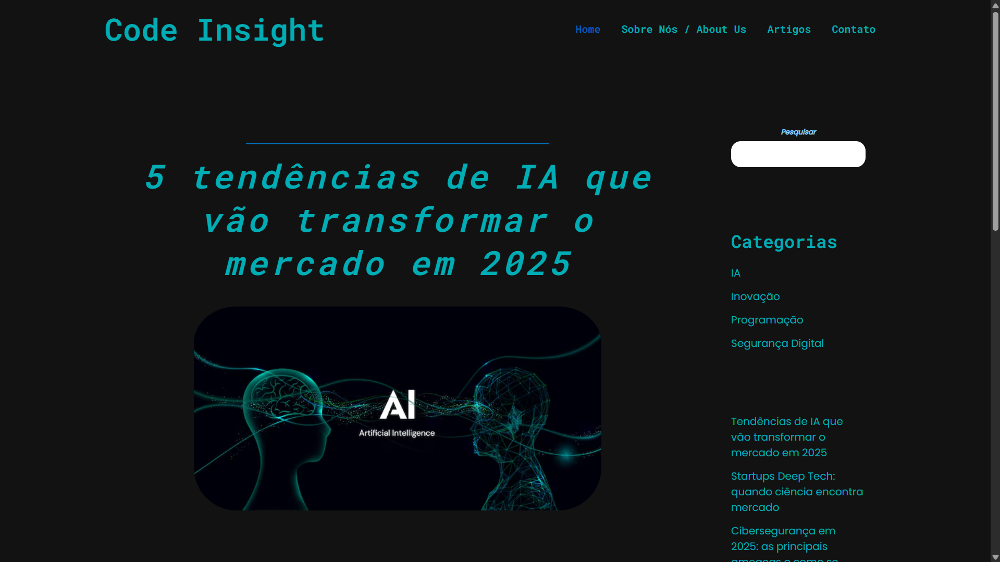
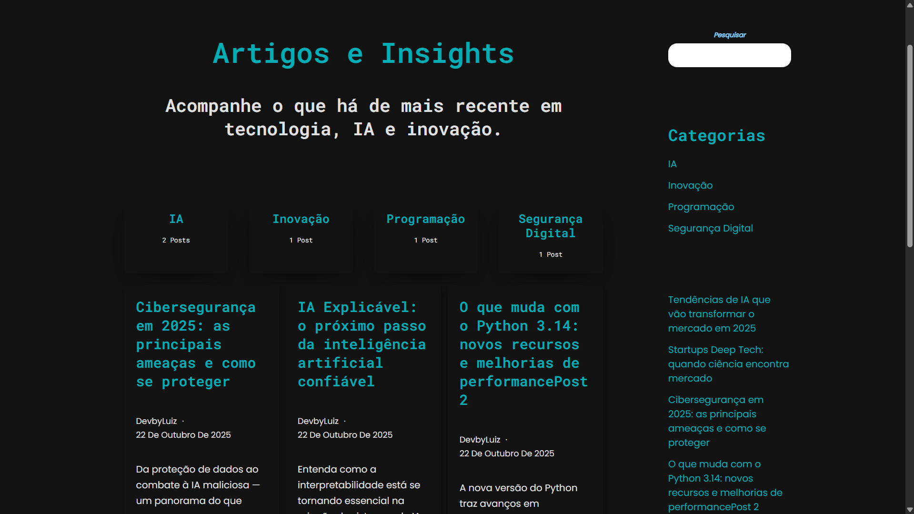
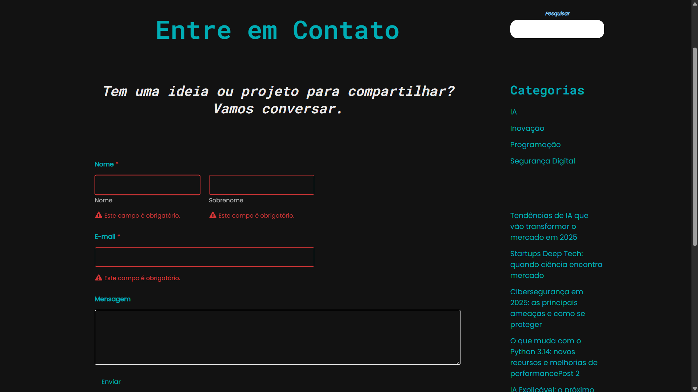

# 💻 Code Insight

O **Code Insight** é um projeto autoral desenvolvido por mim, **Luiz Felipe Maia Teodoro**, como uma **demonstração prática das minhas habilidades em desenvolvimento web**.  
Trata-se de um **blog fictício de tecnologia, inovação, programação e inteligência artificial**, criado inteiramente em **WordPress**, utilizando ferramentas gratuitas e ambiente de hospedagem local.  

O objetivo principal do projeto foi mostrar minha capacidade de **planejar, estruturar e executar um site completo**, aplicando conceitos de **design, layout, tipografia, interatividade e experiência do usuário**, de forma profissional e coerente, mesmo sendo um projeto de estudo e portfólio, sem intenção de produção real.

---

## 🧩 Concepção do Projeto

Para simular um ambiente de trabalho real, solicitei ao **ChatGPT** que assumisse o papel de **contratante fictício**, fornecendo instruções detalhadas, feedback e conteúdo textual completo, incluindo títulos, descrições, imagens de referência e sugestões de seções.  

Esse processo me permitiu reproduzir fielmente a dinâmica de um **projeto cliente–desenvolvedor**, garantindo que cada decisão de design e funcionalidade fosse baseada em especificações precisas e validadas.  
O resultado final demonstra como posso transformar **briefings complexos em soluções web funcionais e visuais**, mesmo em projetos de demonstração.

---

## 🎨 Identidade Visual

O Code Insight apresenta um **design minimalista e futurista**, com identidade tecnológica consistente:

- **Paleta de cores:** Preto (#121212), Branco (#FFFFFF), Cinza-claro (#E0E0E0) e Azul-ciano (#00ADB5)  
- **Tipografia monoespaçada:** remetendo à estética de código-fonte  
- **Layout responsivo e limpo**, com contraste equilibrado  
- **Efeitos de hover e parallax nos posts**, adicionando interatividade e profundidade visual  
- **Performance otimizada**, garantindo carregamento rápido e experiência fluida mesmo em ambiente local

---

## ⚙️ Estrutura e Funcionalidades

### 🏠 Página Inicial (Home)
- Artigo principal em destaque com imagem de capa e resumo  
- **Grade de posts recentes** com título, autor, resumo e botão “Ler mais”  
- **Efeitos de zoom e sombra** nos cards ao passar o mouse

### 👤 Página “Sobre Nós”
- Missão, visão e valores do projeto  
- Biografia fictícia do autor *DevbyLuiz*  
- Sidebar com pesquisa, categorias e posts recentes  
- Ícones com efeito hover verde

### 📰 Página “Artigos e Insights”
- Artigos categorizados: **IA, Inovação, Programação e Segurança Digital**  
- Botões de filtro por categoria para facilitar a navegação  
- Cards consistentes com título, resumo, autor e botão de leitura

### 🧠 Página de Artigo Individual
- Estrutura clara com imagem de capa, título, autor e data  
- Palavras-chave destacadas em negrito  
- **Efeito parallax** aplicado apenas nas imagens dos posts  
- Layout otimizado para desktop e coerente com identidade visual do projeto

### ✉️ Página de Contato
- Formulário funcional com campos para Nome, E-mail e Mensagem  
- Informações de contato institucionais fictícias  
- Sidebar com categorias e posts recentes

### ⚫ Rodapé (Footer)
- Ícones sociais: Twitter, LinkedIn e GitHub (simulados)  
- Menu de navegação secundário (Home, Sobre, Artigos e Contato)  
- Créditos: “© 2025 Code Insight | Todos os direitos reservados.”

---

## 🔧 Detalhes Técnicos

- **CMS:** WordPress  
- **Tema Base:** Astra (Child Theme personalizado)  
- **Ferramentas:** Elementor, Custom CSS e configurações nativas do WP  
- **Hospedagem:** Ambiente local (LocalWP)  
- **Recursos visuais:** Layout responsivo, tipografia monoespaçada, efeitos de hover e parallax (nos posts)

---

## 🚀 Resultado Final

O **Code Insight** é uma vitrine de minhas competências em **desenvolvimento web, design e experiência do usuário**, mostrando:

- Capacidade de planejar e executar **sites completos em WordPress**  
- Transformação de **briefings detalhados em soluções visuais e funcionais**  
- Aplicação de **layout responsivo, tipografia coerente e interatividade**  
- Organização de conteúdo e identidade visual consistente  

Embora seja um **projeto de demonstração**, ele representa fielmente como eu abordo um **desenvolvimento web profissional**, desde a concepção até a execução completa do site.

---

## 🖼️ Visualização do Projeto

Para que você possa ter um **deslumbre do site**, mesmo sem hospedagem online, incluí prints e gifs das principais páginas e efeitos, Veja todos nas pastas nomeadas de acordo:

### Gifs Demonstrativos

(gifs/efeitoparalax.gif)
(gifs/effectshome.gif)
(gifs/hovericons.gif)

### Prints

  
  

